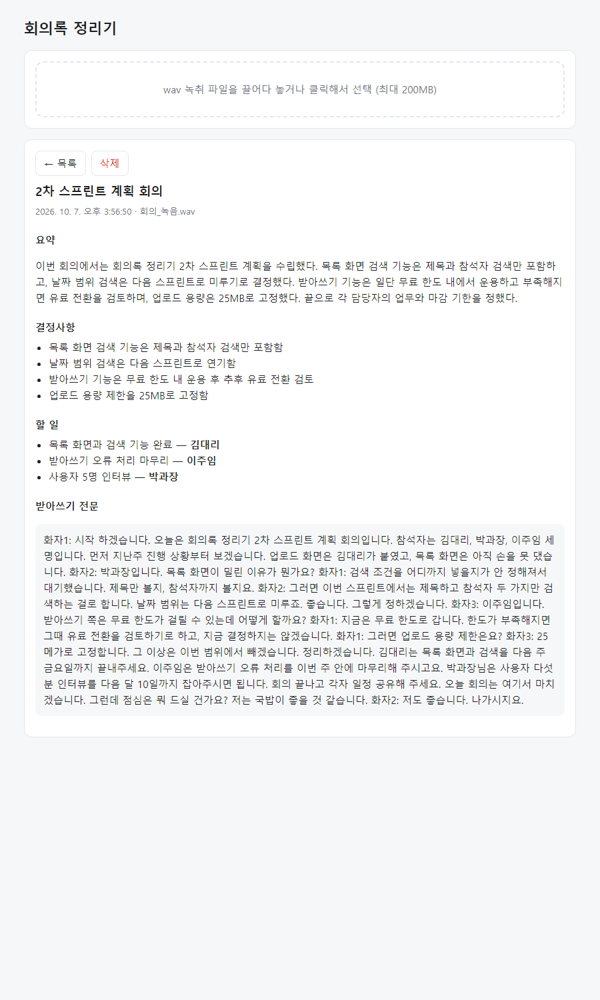
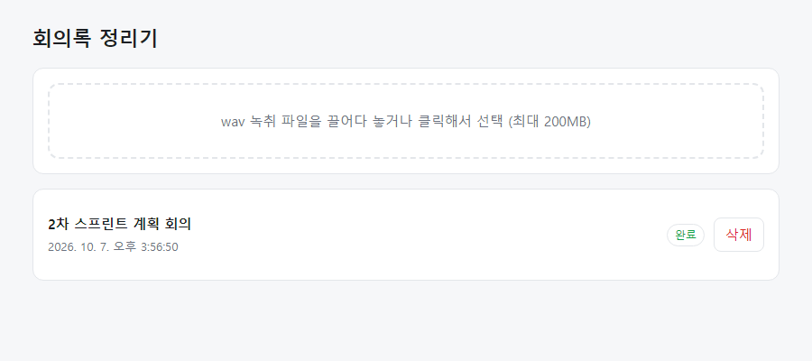

# 회의록 정리기 (meetingnote-simple)

wav 녹취 파일을 올리면 Gemini(`gemini-3.1-flash-lite`)가 받아쓰기를 하고,
**요약 · 결정사항 · 할 일**로 나눠서 저장해 주는 간단한 웹 앱입니다.

## 화면

**회의록 상세** — 요약 / 결정사항 / 할 일 / 받아쓰기 전문



**회의록 목록** — 저장된 회의록 열기·삭제



## 기능

- wav 업로드 → 받아쓰기 + 요약 · 결정사항 · 할 일(담당자/기한) 분리
- 회의록 저장 · 다시 보기 · 삭제 (`data/` 폴더에 JSON으로 저장)
- 받아쓰기 실패 시 자동 재시도 (5 → 10 → 20 → 40초 간격, 최대 5회), 모두 실패하면 "다시 시도" 버튼
- 15MB 초과 파일은 Gemini Files API로 업로드 (최대 200MB)
- 서버를 재시작해도 중단된 작업을 이어서 처리

## 실행

Node.js 20.12 이상 필요. 별도 패키지 설치는 없습니다.

1. 프로젝트 폴더에 `.env` 파일을 만듭니다.

   ```
   GEMINI_API_KEY=발급받은_키
   GEMINI_MODEL=gemini-3.1-flash-lite
   ```

2. 서버를 실행하고 http://localhost:3000 에 접속합니다.

   ```
   npm start
   ```

`.env`와 `data/`(저장된 회의록)는 `.gitignore`에 들어 있어 저장소에 올라가지 않습니다.

## 참고

- 내용이 없는 오디오(무음 등)에서는 모델이 그럴듯한 내용을 지어낼 수 있으니, 결과는 전문과 대조해서 확인하세요.
- 할 일의 기한(`due`)은 녹취에 언급돼도 비어 있을 수 있습니다.
